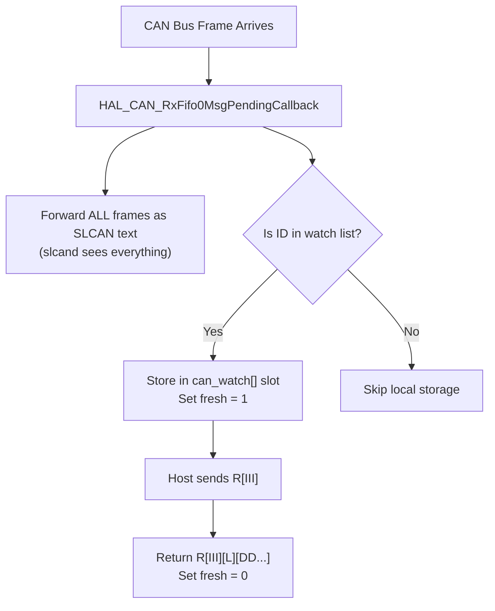
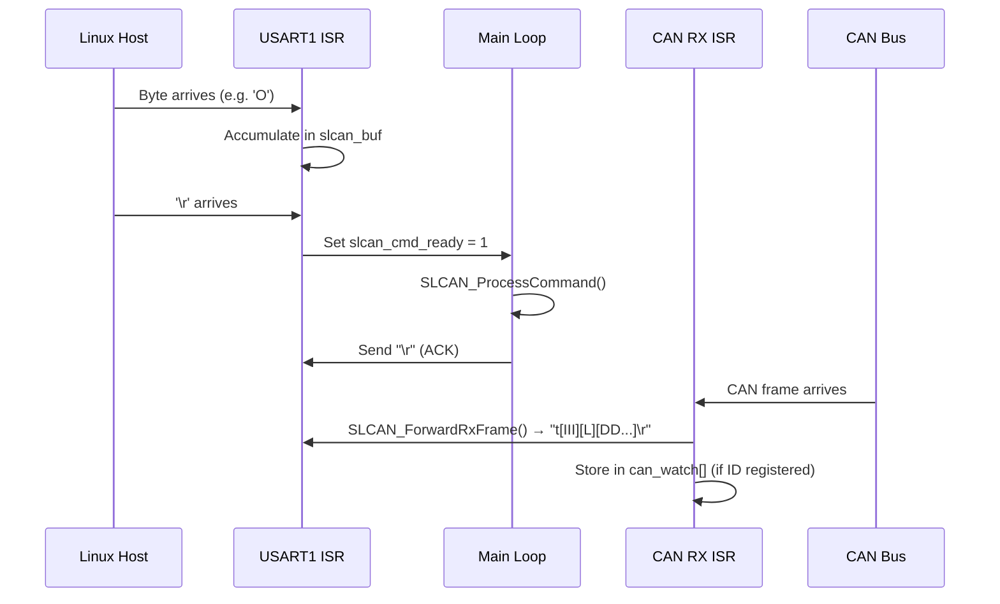

# SLCAN USB-to-CAN Adapter Firmware — Walkthrough

## Architecture Overview


## Source Files

| File | Purpose |
|------|---------|
| [main.c](file:///d:/Embedded%20Systems/GP/USB_TO_CAN/Core/Src/main.c) | SLCAN protocol engine, CAN/UART init, command parser, watch list |
| [stm32f1xx_hal_msp.c](file:///d:/Embedded%20Systems/GP/USB_TO_CAN/Core/Src/stm32f1xx_hal_msp.c) | CAN pin remap to PB8/PB9, NVIC IRQ enable for UART+CAN |
| [stm32f1xx_it.c](file:///d:/Embedded%20Systems/GP/USB_TO_CAN/Core/Src/stm32f1xx_it.c) | `USART1_IRQHandler` + `USB_LP_CAN1_RX0_IRQHandler` ISRs |

## Pin Remap — The Critical Part

> [!IMPORTANT]
> The STM32F103 shares PA11/PA12 between CAN and USB. Since USB is broken (shared SRAM buffer errata), we remap CAN to PB8/PB9 via `__HAL_AFIO_REMAP_CAN1_2()` in the MSP file, freeing PA11/PA12 entirely.

### Pinout Summary

| Function | Pin | Direction |
|----------|-----|-----------|
| USART1 TX | PA9 | Out → USB-to-TTL RX |
| USART1 RX | PA10 | In ← USB-to-TTL TX |
| CAN RX | PB8 | In ← MCP2551 TXD |
| CAN TX | PB9 | Out → MCP2551 RXD |

## SLCAN Protocol Commands

### Standard LAWICEL Commands (slcand compatible)

| Command | Format | Response | Description |
|---------|--------|----------|-------------|
| `S` | `S[0-8]\r` | `\r` | Set CAN bitrate (must be sent before `O`) |
| `O` | `O\r` | `\r` | Open/start CAN channel |
| `C` | `C\r` | `\r` | Close/stop CAN channel |
| `t` | `t[III][L][DD...]\r` | `Z\r` | Transmit standard CAN frame |
| `V` | `V\r` | `V1010\r` | Hardware version |
| `N` | `N\r` | `NSTM32\r` | Serial number |
| `F` | `F\r` | `F00\r` | Status flags |

### Custom Watch List Commands (encoder monitoring)

| Command | Format | Response | Description |
|---------|--------|----------|-------------|
| `r` | `r[III]\r` | `\r` | **Register** CAN ID for monitoring (up to 8 IDs) |
| `R` | `R[III]\r` | `R[III][L][DD...]\r` | **Read** latest data from a watched CAN ID |
| `u` | `u[III]\r` | `\r` | **Unregister** a CAN ID, stop tracking it |

> [!NOTE]
> `III` = 3-digit hex Standard CAN ID (e.g. `009`), `L` = 1-digit DLC, `DD` = hex data byte pairs.
> Error responses use `\a` (BEL character) per LAWICEL spec.

### Watch List Data Flow



### Usage Example — Encoder on CAN ID 0x009

```
S6\r            → Set 500 kbps                        → \r
O\r             → Open CAN channel                    → \r
r009\r          → Register ID 0x009 for watching       → \r
R009\r          → Read latest encoder data             → R00980123456789ABCDEF\r
R009\r          → Read again (if no new data)          → \a (no fresh data)
u009\r          → Stop watching ID 0x009               → \r
C\r             → Close CAN channel                    → \r
```

## CAN Configuration

### Bitrate Table (APB1 = 36 MHz)

| Code | Bitrate | Prescaler | BS1 | BS2 | Sample Point |
|------|---------|-----------|-----|-----|-------------|
| S0 | 10 kbps | 200 | 15 TQ | 2 TQ | 88.9% |
| S1 | 20 kbps | 100 | 15 TQ | 2 TQ | 88.9% |
| S2 | 50 kbps | 40 | 15 TQ | 2 TQ | 88.9% |
| S3 | 100 kbps | 20 | 15 TQ | 2 TQ | 88.9% |
| S4 | 125 kbps | 16 | 15 TQ | 2 TQ | 88.9% |
| S5 | 250 kbps | 8 | 15 TQ | 2 TQ | 88.9% |
| **S6** | **500 kbps** | **4** | **15 TQ** | **2 TQ** | **88.9%** |
| S7 | 800 kbps | 3 | 12 TQ | 2 TQ | 86.7% |
| S8 | 1000 kbps | 2 | 15 TQ | 2 TQ | 88.9% |

### CAN Settings

| Setting | Value | Rationale |
|---------|-------|-----------|
| AutoBusOff | DISABLE | User-preference — no automatic bus-off recovery |
| AutoWakeUp | DISABLE | User-preference |
| AutoRetransmission | DISABLE | User-preference — no retry on TX failure |
| RX Filter | Accept All | Mask = 0x0000, all IDs pass through |

## Linux Usage

```bash
# Attach the adapter (adjust /dev/ttyUSB0 to your port)
sudo slcand -o -s6 -t hw /dev/ttyUSB0 slcan0

# Bring up the interface
sudo ip link set slcan0 up

# Monitor all CAN traffic (encoder data will appear here)
candump slcan0

# Send a frame (ID=0x123, DLC=2, Data=0xAB 0xCD)
cansend slcan0 123#ABCD

# Tear down
sudo ip link set slcan0 down
sudo killall slcand
```

> [!TIP]
> The `-s6` flag in `slcand` corresponds to the `S6` command = 500 kbps. Match this to your CAN bus speed (e.g. `-s8` for 1 Mbps).

## Interrupt Architecture


